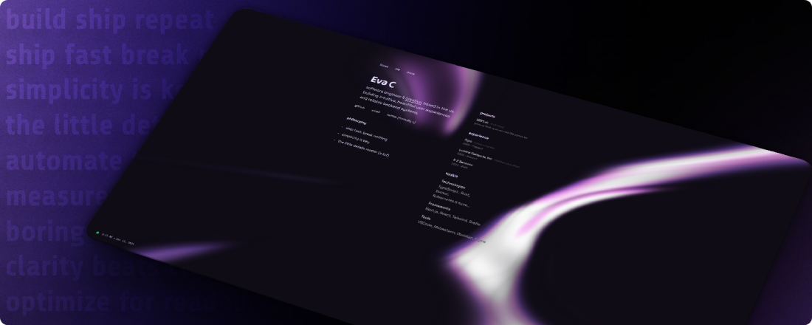

  

# 👋 Hiya, I’m Eva

I’m an **18-year-old software engineer** who loves building clean, reliable systems and cherishing the little details.  

> *“Build fast, break nothing & Obsess over every detail”*

Most of what I do projects, write-ups, experiments - lives here → **[eva.pink](https://eva.pink)** 

### What Im working on!
- <a href="https://vert.sh" target="_blank" rel="noopener"><strong>VERT.sh</strong></a> - Privacy-first, open-source file converter (as seen on Hacker News, XDA, @Github and more!)
- <a href="https://pyrodactyl.dev/" target="_blank" rel="noopener"><strong>Pyrodactyl</strong></a> - Pyrodactyl is the world's best Pterodactyl panel. Unmatched performance and features. 
- **bloom** - Rust-based file server with ShareX support *soon tm* 

More projects and context on my site.

 

### 🛠️ Tech I build with
TypeScript · Rust · React & Svelte · Astro · Docker · Kubernetes · 

 

### About me (non-code)
- 18 and happily obsessed with building things  
- I have **ferrets** (tiny chaos creatures, much loved)  
- I care deeply about simplicity, UX, and making things that *just feel right*  

If it’s not here, it’s probably on **[eva.pink](https://eva.pink)** 

 

  

